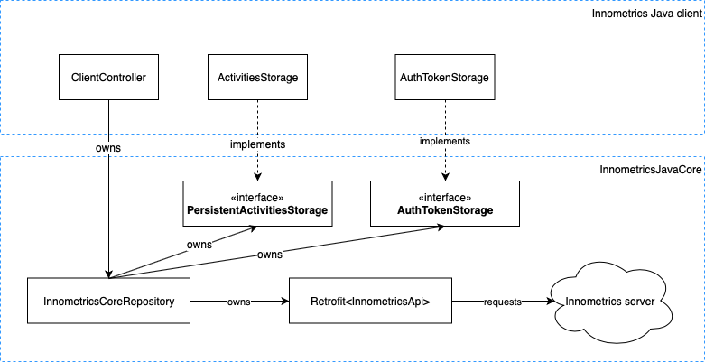

# InnometricsJavaCore

A Java library that provides core backend functionality for Innometrics tracking clients. 

## What is platform agnostic?
InnometricsJavaCore provides following functionality regardless of the platform it runs on:
- Innometrics API wrapper
- Necessary data structures with JSON serialization
- Core repository with simple API which automatically handles activity addition, persistence and submission

## What is platform-specific?
InnometricsJavaCore requires clients to provide following platform specific functionality by implementing appropriate interfaces:
- Secure API auth token storage
- Persistent activity list storage

## Architecture

## Installation
InnometricsJavaCore is intended to be used by other Innometrics tracking clients written in Java. Here is how to install it using Gradle and Git Sublidules: 
1. In your project root directory create a git submodule with this repository.
2. In your `build.gradle` `dependencies` section add: `implementation project(':innometrics-java-core')`

## Questions
Contact me in [Telegram](t.me/khabiroff)